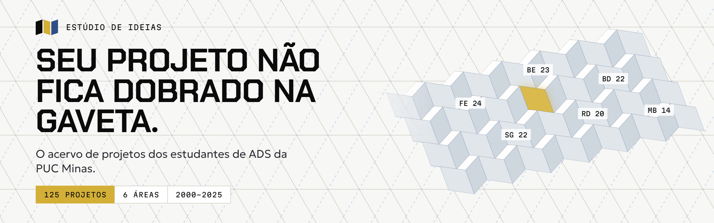
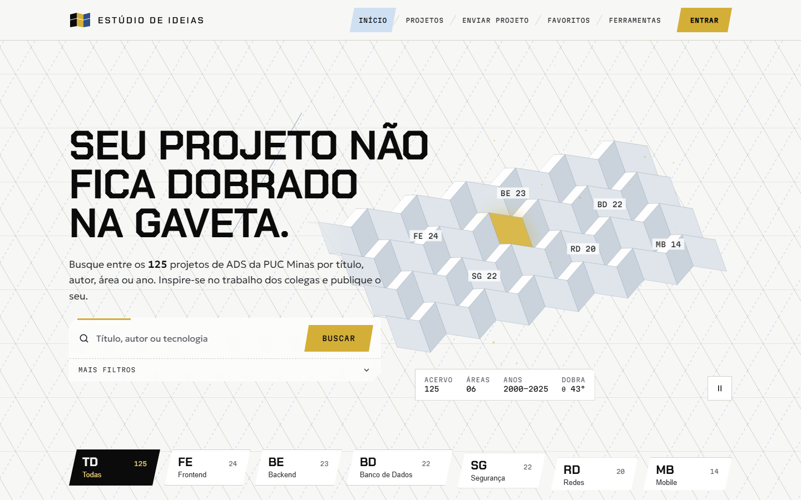
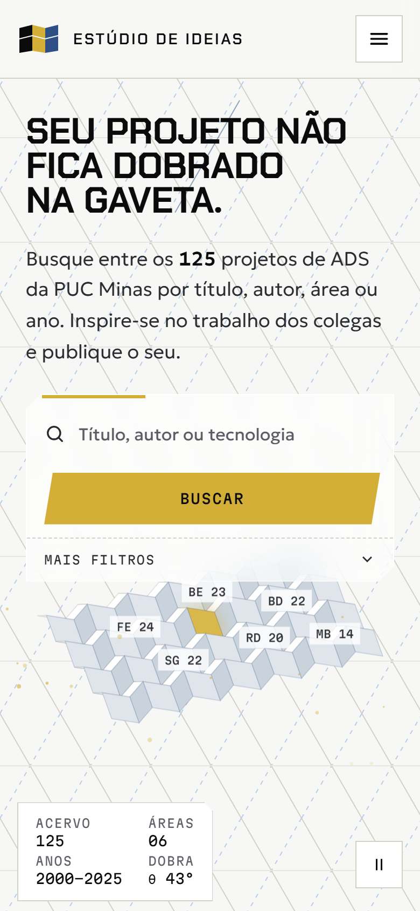
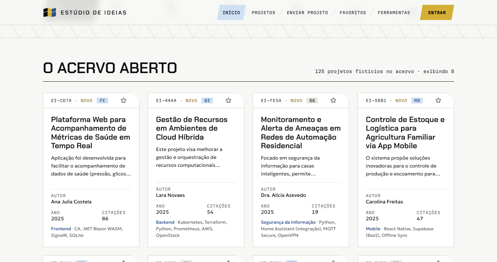
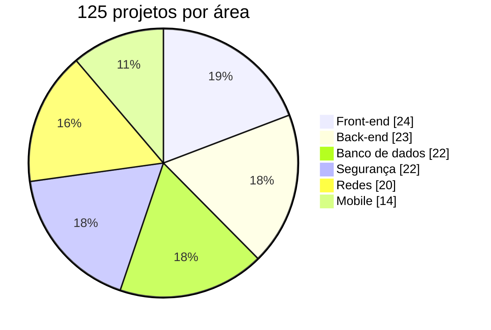
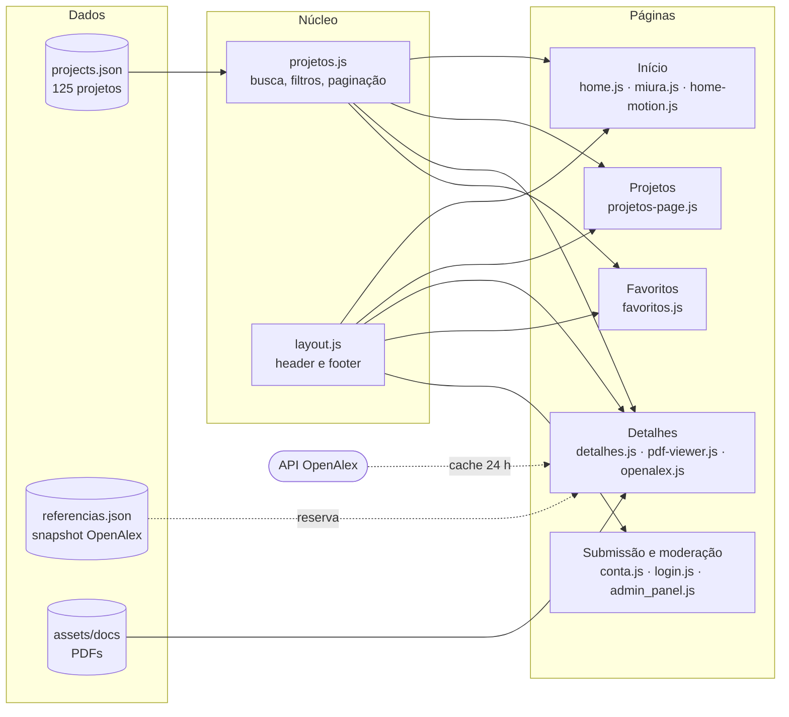

<a href="https://maiconvts.github.io/estudio-de-ideias/">
  
</a>

<p align="center">
  <a href="https://maiconvts.github.io/estudio-de-ideias/"></a>
  <a href="https://github.com/MaiconVts/estudio-de-ideias/actions/workflows/deploy.yml"></a>
  <a href="https://github.com/MaiconVts/estudio-de-ideias/commits/main"></a>
  <br>
  
  
  
  <br>
  
  
  
  
  
  
  
</p>

<p align="center">
  <b><a href="https://maiconvts.github.io/estudio-de-ideias/">Abrir o site</a></b>
  &nbsp;·&nbsp; <a href="#funcionalidades">Funcionalidades</a>
  &nbsp;·&nbsp; <a href="#conta-demo">Conta demo</a>
  &nbsp;·&nbsp; <a href="#como-rodar">Como rodar</a>
  &nbsp;·&nbsp; <a href="REDESIGN.md">Redesign</a>
  &nbsp;·&nbsp; <a href="#arquitetura">Arquitetura</a>
  &nbsp;·&nbsp; <a href="#documentação">Documentação</a>
  &nbsp;·&nbsp; <a href="#apresentação">Apresentação</a>
  &nbsp;·&nbsp; <a href="#equipe">Equipe</a>
</p>

---

## Sobre

Todo semestre, estudantes de ADS entregam projetos que funcionam, são avaliados e acabam esquecidos numa pasta. O **Estúdio de Ideias** é o acervo onde esses trabalhos continuam acessíveis: quem está começando um projeto encontra o que colegas já fizeram na mesma área, lê o documento completo e envia o próprio trabalho para publicação.

O foco é sempre o estudante. A busca responde enquanto você digita, os filtros cabem numa só linha e cada projeto abre com o documento inteiro, sem download obrigatório.

> Desenvolvido como projeto do eixo 1 (Desenvolvimento de Aplicação Web Front-End) do curso de Tecnologia em Análise e Desenvolvimento de Sistemas da PUC Minas Virtual, 1º semestre de 2025, e redesenhado em 2026.

<table>
  <tr>
    <td width="68%"></td>
    <td width="32%"></td>
  </tr>
  <tr>
    <td align="center"><sub>Desktop, 1440 px</sub></td>
    <td align="center"><sub>Celular, 390 px</sub></td>
  </tr>
</table>

## Funcionalidades

| | Recurso | O que faz |
| :---: | :--- | :--- |
| 🔎 | **Busca com sugestões** | Procura por título e autor enquanto você digita, com sugestões navegáveis pelas setas do teclado. |
| 🗂️ | **Filtros por área e ano** | Front-end, back-end, banco de dados, segurança, redes e mobile, combináveis com o ano de entrega. |
| 📈 | **Ordenação** | Por citações, pelos mais recentes ou pelos mais antigos, com paginação no acervo completo. |
| ⭐ | **Favoritos** | Guarda os projetos que interessam no próprio navegador, sem precisar de conta. |
| 📄 | **Leitor de PDF embutido** | Abre o documento de cada projeto com pdf.js, inclusive no Chrome do Android, que não exibe PDF em `<iframe>`. A biblioteca só carrega quando o leitor chega perto da tela. |
| 📚 | **Leituras relacionadas** | Referências acadêmicas reais da API pública do [OpenAlex](https://openalex.org), com cache de 24 h, limite de chamadas e um snapshot local como reserva. |
| 📤 | **Submissão e moderação** | Formulário de envio de projeto e painel de moderação para aprovar ou rejeitar o que entra no acervo, com confirmação em diálogo acessível. |
| 🔐 | **Contas e conta demo** | Cadastro e login no navegador, com papéis de autor e moderador. A conta demo abre a moderação com um clique. |
| 🧰 | **Ferramentas e guias** | Normas, tutoriais, guia de apresentação, eventos, carreiras e FAQ para quem está montando o próprio projeto. |

<p align="center">
  
  <br><sub>O acervo: cada card mostra área, ano, autor, tecnologias e citações.</sub>
</p>

### O acervo em números



## Design

A identidade parte da **dobra Miura** (*Miura-ori*), a dobradura que abre um mapa inteiro com um só gesto. No topo da página, uma folha dobrada se abre ao carregar e acompanha a rolagem. Cada área do acervo ocupa uma região da folha, e o projeto em destaque aparece numa célula dourada.

- **Geometria real:** a folha é calculada pelas equações da dobra Miura e desenhada em canvas 2D, com faces ordenadas por profundidade e sombreadas pela normal.
- **Paleta de papel:** folha clara, linhas de montanha e de vale, tinta quase preta e um dourado de destaque. Tudo vem de tokens em [`base.css`](codigo-fonte/assets/css/base.css).
- **Tipografia:** Chakra Petch nos títulos, Geologica no texto e Martian Mono em códigos e leituras.
- **Movimento com propósito:** GSAP com ScrollTrigger e SplitText para a entrada e o parallax, e Lenis no scroll suave. As mesmas curvas e durações valem no site inteiro.
- **Acessível por padrão:** título e textos ficam visíveis mesmo se a animação falhar; há botão para pausar a animação contínua; `prefers-reduced-motion` desliga parallax, scroll suave e revelações; e o canvas é decorativo (`aria-hidden`).

## Conta demo

| E-mail | Senha | Papel |
| :--- | :--- | :--- |
| `demo@estudiodeideias.app` | `demo1234` | Moderador(a) |

Na página **Entrar**, o botão *Entrar com a conta demo* faz o login direto e abre o painel de moderação. Contas criadas pelo cadastro entram como **autor(a)** e vão para o envio de projeto; o painel de moderação fica restrito a moderadores.

### O limite do front-end

Este repositório é só o front-end, e ele vai até onde um navegador consegue ir sem servidor:

- **Contas:** guardadas no `localStorage`, com a senha transformada em SHA-256 com sal por usuário (Web Crypto). A sessão não guarda senha e vale por 7 dias.
- **Envios e moderação:** um projeto enviado fica pendente no próprio navegador; aprovar ou rejeitar muda o status ali mesmo.
- **Contato:** o formulário valida e confirma o envio, mas avisa que a mensagem não sai do navegador.
- **Depende do back-end:** recuperação de senha por e-mail, login social, verificação de e-mail, upload real de arquivos e moderação compartilhada entre pessoas. Onde isso aparece na interface, o site diz que precisa de servidor, em vez de oferecer um botão que não funciona.

## Redesign

O antes e depois das telas principais está em [`REDESIGN.md`](REDESIGN.md). Para mais detalhes, acesse https://maiconvts.github.io/estudio-de-ideias/.

## Como rodar

O site é estático: sem build, sem `npm install`. Só é preciso um servidor local, porque os dados são carregados com `fetch`.

```bash
git clone https://github.com/MaiconVts/estudio-de-ideias.git
cd estudio-de-ideias

# Python 3
python -m http.server 8000 --directory codigo-fonte

# ou Node
npx serve codigo-fonte
```

Depois abra <http://localhost:8000>. Aberto direto do disco (`file://`), o navegador bloqueia a leitura do acervo e o site avisa como abri-lo.

<details>
<summary><b>Regerar os PDFs e as referências do acervo</b></summary>

<br>

O script [`scripts/gerar_documentos.py`](scripts/gerar_documentos.py) lê `projects.json`, busca referências reais no OpenAlex (uma consulta por área) e gera o PDF de cada projeto em `codigo-fonte/assets/docs/`. Se o snapshot `referencias.json` já existir, ele é reaproveitado e nenhuma chamada é feita.

```bash
pip install -r scripts/requirements.txt
python scripts/gerar_documentos.py                           # usa o snapshot
python scripts/gerar_documentos.py --atualizar-referencias   # consulta o OpenAlex de novo
```

</details>

### Publicação

Cada push na `main` dispara o workflow [`deploy.yml`](.github/workflows/deploy.yml), que publica a pasta `codigo-fonte/` no GitHub Pages.

## Arquitetura



<details>
<summary><b>Estrutura de pastas</b></summary>

<br>

```text
estudio-de-ideias/
├── codigo-fonte/            # o site publicado
│   ├── index.html           # início
│   ├── projetos.html        # acervo completo
│   ├── detalhes.html        # projeto + leitor de PDF + leituras relacionadas
│   ├── favoritos.html · submissao.html · admin.html · login.html
│   ├── ferramentas.html · normas.html · tutoriais.html · guia_apresentacao.html
│   ├── eventos.html · carreiras.html · faq.html · contato.html · privacidade.html
│   └── assets/
│       ├── css/             # base.css (tokens), layout.css e um arquivo por página
│       ├── js/              # projetos.js (núcleo), conta.js (contas), layout.js e scripts por página
│       ├── data/            # projects.json, referencias.json
│       ├── docs/            # um PDF por projeto
│       └── img/
├── REDESIGN.md              # antes e depois das telas principais
├── documentos/              # documentação acadêmica (contexto, especificação, testes…)
├── apresentacao/            # slides e vídeos da apresentação final
├── scripts/                 # geração dos PDFs e do snapshot de referências
└── .github/workflows/       # deploy no GitHub Pages
```

</details>

### Tecnologias

| Camada | Escolha | Por quê |
| :--- | :--- | :--- |
| Estrutura e estilo | HTML5 semântico, CSS com custom properties | Sem framework: o site abre direto no navegador e publica sem build. |
| Interação | JavaScript puro (ES2020+) | Uma API única em `window.estudioIdeias` serve todas as páginas; `window.estudioConta` cuida das contas. |
| Contas | Web Crypto (SHA-256 com sal) + `localStorage` | O máximo de segurança possível sem servidor, sem senha em texto puro. |
| Movimento | GSAP 3 (ScrollTrigger, SplitText) + Lenis | Coreografia de entrada e parallax ligados ao scroll. |
| Documentos | pdf.js 3 | Renderização em canvas, compatível com o celular. |
| Referências | API OpenAlex | Bibliografia acadêmica real, com cota respeitada por cache. |
| Hospedagem | GitHub Pages + GitHub Actions | Deploy automático a cada push. |

## Documentação

| # | Documento |
| :---: | :--- |
| 01 | [Documentação de Contexto](<documentos/01-Documentação de Contexto.md>) |
| 02 | [Especificação do Projeto](<documentos/02-Especificação do Projeto.md>) |
| 03 | [Metodologia](<documentos/03-Metodologia.md>) |
| 04 | [Projeto de Interface](<documentos/04-Projeto de Interface.md>) |
| 05 | [Template Padrão da Aplicação](<documentos/05-Template padrão da Aplicação.md>) |
| 06 | [Programação de Funcionalidades](<documentos/06-Programação de Funcionalidades.md>) |
| 07 | [Plano de Testes de Software](<documentos/07-Plano de Testes de Software.md>) |
| 08 | [Registro de Testes de Software](<documentos/08-Registro de Testes de Software.md>) |
| 09 | [Referências Bibliográficas](<documentos/09-Referências Bibliográficas.md>) |

O histórico de versões do código está em [`codigo-fonte/README.md`](codigo-fonte/README.md).

## Apresentação

<p>
  <a href="apresentacao/estudio_de_ideias.pdf"></a>
  <a href="https://vimeo.com/1097078388"></a>
</p>

A apresentação final, de junho de 2025, está guardada em [`apresentacao/`](apresentacao/README.md), com os slides e as gravações originais.

## Equipe

<table>
  <tr>
    <td align="center"><b>Allan Rodrigues</b><br><sub>Submissão e administração</sub></td>
    <td align="center"><b>Eduardo Moreira</b><br><sub>Ferramentas</sub></td>
    <td align="center"><b>Hugo Vaz</b><br><sub>Login e detalhes</sub></td>
    <td align="center"><b>Maicon Theodoro</b><br><sub>Início e redesign de 2026</sub></td>
    <td align="center"><b>Vinícius Silva</b><br><sub>Projetos e favoritos</sub></td>
  </tr>
</table>

**Orientador:** Prof. Marco Rodrigo Costa, PUC Minas

## Como citar

O repositório traz um [`citation.cff`](citation.cff); o botão **Cite this repository**, na lateral do GitHub, gera a referência em APA ou BibTeX.

---

<p align="center">
  <br>
  <sub>Estúdio de Ideias · PUC Minas · Análise e Desenvolvimento de Sistemas</sub>
</p>
