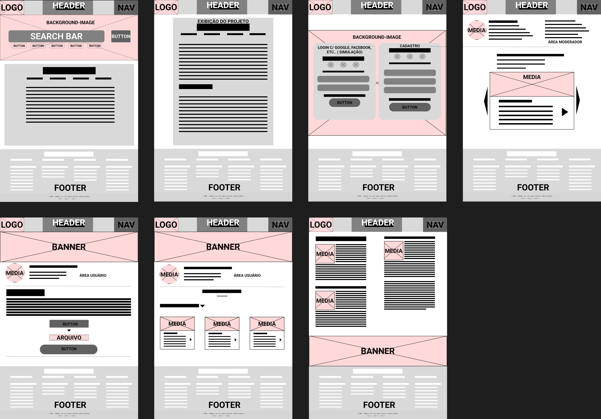
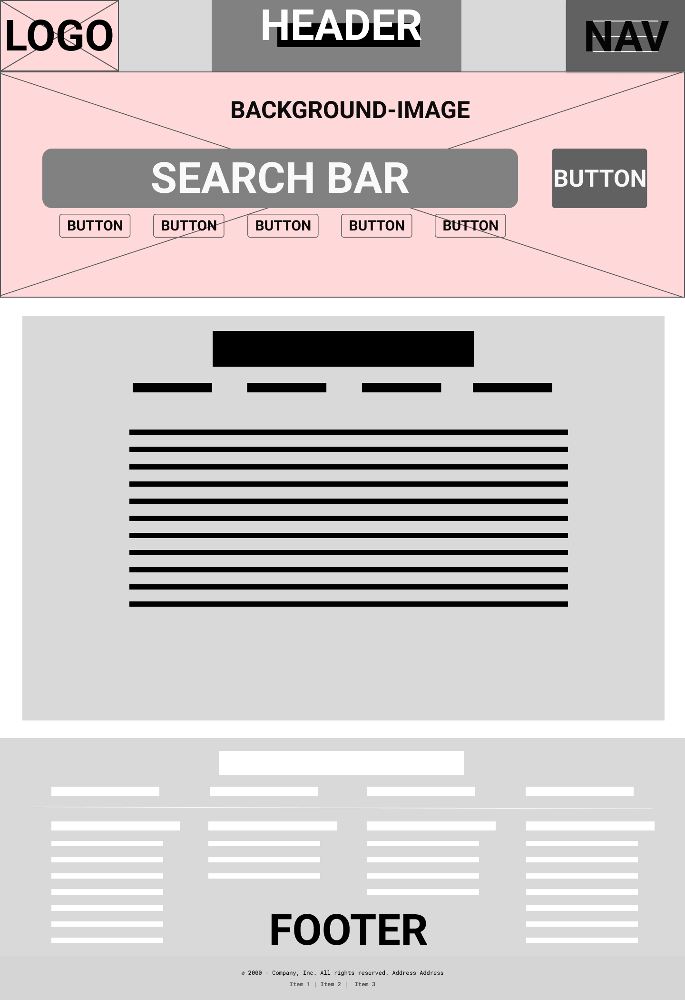
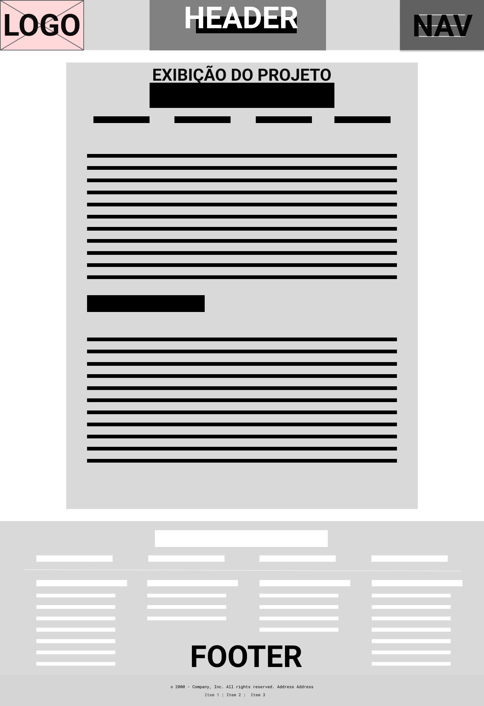
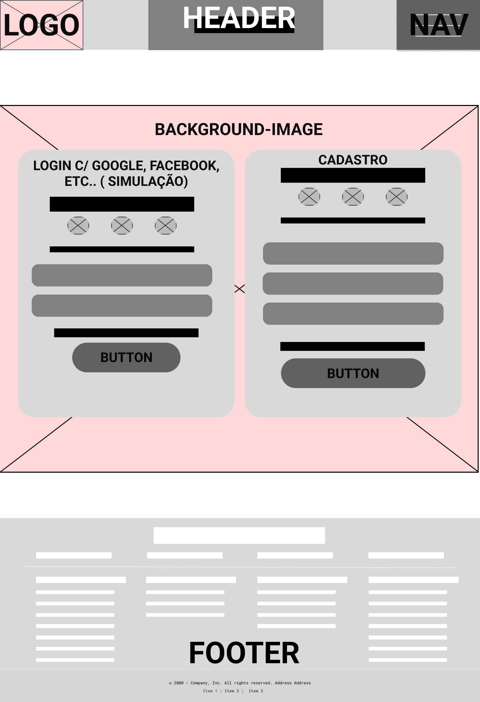
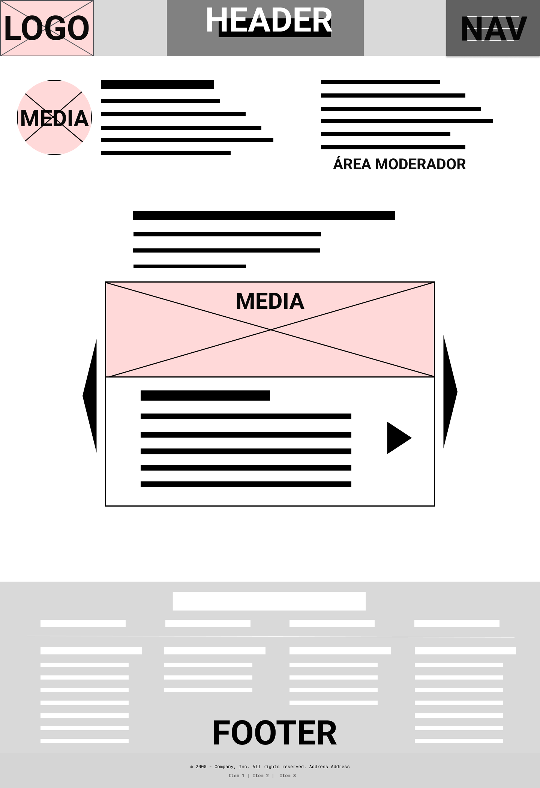
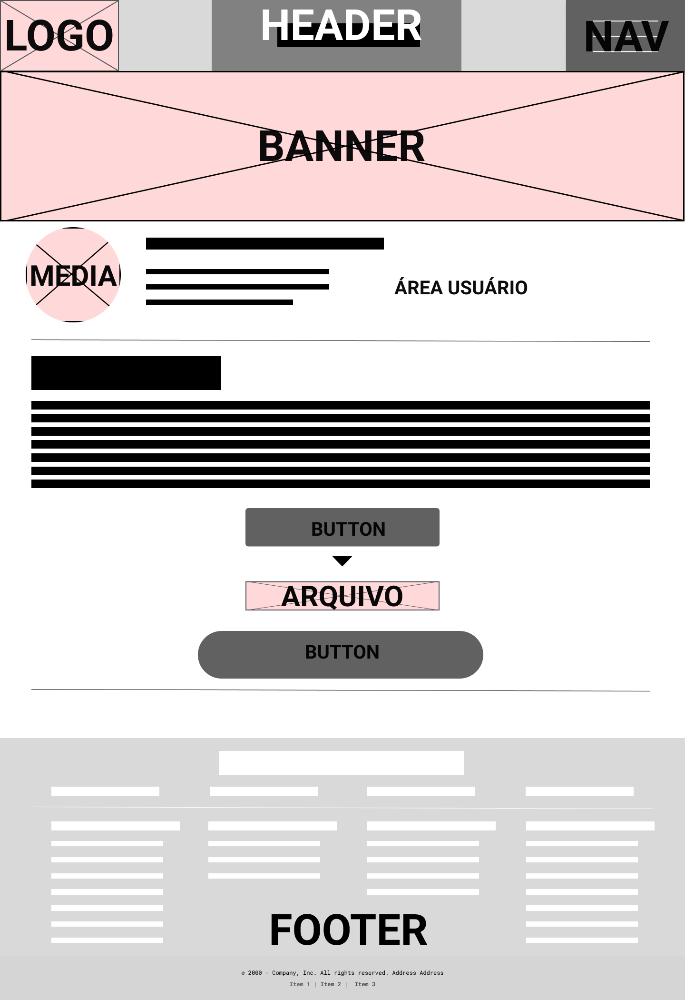
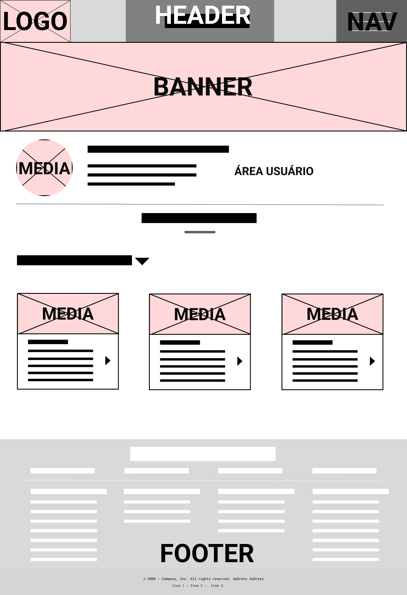
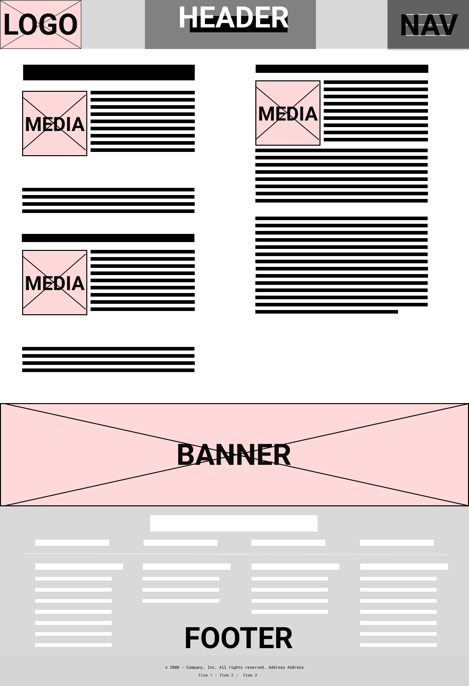

# Projeto de Interface

## User Flow

O fluxograma apresentado na figura 1 mostra o fluxo principal de interação dos usuários com o sistema, cobrindo tarefas como envio, validação, pesquisa, filtragem, visualização de detalhes e gerenciamento de favoritos dos projetos. Cada uma das telas deste fluxo é detalhada na seção de Protótipo de baixa fidelidade que se segue. Para visualizar, acesse <a href="https://www.figma.com/proto/NcRGohYiZwY7kVc4AncVKM/Gestor-de-Conhecimento-Alfa?node-id=0-1&t=lVFyXOQ6sUQPxZzy-1">Link para o prototipo no FIGMA</a>, 
<a href="https://www.figma.com/design/NcRGohYiZwY7kVc4AncVKM/Gestor-de-Conhecimento-Alfa?node-id=0-1&m=dev&t=Nul7H84zhExz68R2-1">Link para o Dev mode no FIGMA</a>

  

<figure> 
    <figcaption>Figura 1 - Fluxo de telas do usuário</figcaption>
</figure>  
  

## Protótipo de baixa fidelidade

As telas do sistema apresentam uma estrutura comum que é apresentada na figura 2. Nesta estrutura existem 3 grandes blocos, descritos a seguir. São eles:
<ul>
  <li>Cabeçalho - local onde estão dispostos o nome da aplicação web e navegação principal do site (menu da aplicação);</li>
  <li>Conteúdo - apresenta o conteúdo da tela em questão;</li>
  <li>Rodapé - apresenta informações sobre os direitos autorais.</li>
</ul>

<figure> 
  
    <figcaption>Figura 2 - Estrutura padrão do site</figcaption>
</figure> 

### 1. Página Home

Descrição: A página índice da aplicação. É a página inicial que usuários não logados acessam. Exibe um pequeno resumo do que a aplicação se trata e permite que o usuário se familiarize com as funcionalidades disponíveis.
Funcionalidade: Oferece acesso às principais seções do sistema e serve como ponto de partida para navegação.

<figure> 
  <figcaption>Figura 3 - Página Home</figcaption>
</figure> 

### 2. Página de Detalhes do Projeto

Descrição: Apresenta os detalhes completos de um projeto selecionado. Exibe atributos como título, descrição, autores e ano de publicação.
Funcionalidade: Permite visualizar as informações detalhadas do projeto e oferece a opção de download do conteúdo.

<figure> 
  <figcaption>Figura 4 - Página de Detalhes do Projeto</figcaption>
</figure> 

### 3. Página Login/Cadastro

Descrição: Oferece um formulário para login e cadastro de novos usuários, com opções para recuperação de senha.
Funcionalidade: Permite o acesso a funcionalidades exclusivas para usuários cadastrados e autenticados.

<figure> 
  <figcaption>Figura 5 - Página Login/Cadastro</figcaption>
</figure> 

### 4. Página Restrita (Moderador)

Descrição: Área restrita acessível apenas aos moderadores do sistema.
Funcionalidade: Os moderadores podem validar projetos, decidindo se eles devem ser aprovados ou rejeitados. Permite o gerenciamento e controle de conteúdo submetido pelos usuários.

<figure> 
  <figcaption>Figura 6 - Página Restrita (Moderador)</figcaption>
</figure> 

### 5. Página de Envio de Projeto

Descrição: Um formulário público onde os acadêmicos podem submeter seus projetos.
Funcionalidade: Permite o envio de projetos para registro e compartilhamento, preenchendo campos como título, descrição, mídia associada e arquivo do projeto.

<figure> 
  <figcaption>Figura 7 - Página de Envio de Projeto</figcaption>
</figure> 

### 6. Página de Favoritos

Descrição: Permite que os usuários visualizem todos os projetos marcados como favoritos.
Funcionalidade: Facilita o acesso rápido a documentos de interesse previamente marcados, permitindo que o usuário retorne a conteúdos importantes.

<figure> 
  <figcaption>Figura 8 - Página de Favoritos</figcaption>
</figure> 

### 7. Página de Recomendações de Ferramentas

Descrição: Contém informações úteis, tutoriais e ferramentas para auxiliar os acadêmicos na criação e aprimoramento de projetos.
Funcionalidade: Divulga recomendações, tutoriais e outras informações relevantes para melhorar o desenvolvimento dos projetos.

<figure> 
  <figcaption>Figura 9 - Página de Recomendações de Ferramentas</figcaption>
</figure> 

## Considerações Finais
Os protótipos foram desenvolvidos visando clareza, acessibilidade e funcionalidade, com um layout que prioriza a usabilidade e navegação intuitiva.

---

2025 - Projeto Estúdio de Ideias - PUC Minas
