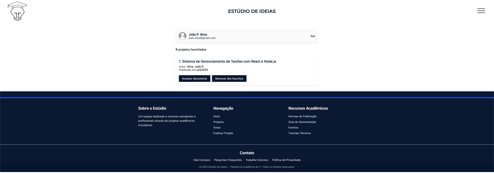

# Programação de Funcionalidades

**Pré-requisitos:** Especificação do Projeto, Metodologia, Projeto de Interface, Arquitetura da Solução

---

## Tela de Cadastro (RF-001)

**Responsável:** Hugo Vaz

O acesso à tela de cadastro poderá ser feito através da opção de menu “Cadastre-se”. As estruturas de dados foram baseadas em HTML, CSS e JS.

**Exemplo da tela de cadastro:**  
``

**Requisito atendido:**  
RF-001: O site deve permitir ao usuário cadastrar uma conta.

**Artefatos da funcionalidade:**

- `cadastro.html`
- `cadastro.css`
- `cadastro.js`
- `mobile-navbar.js`

**Instruções de acesso:**  
Abra um navegador e informe a seguinte URL:  
*https://icei-puc-minas-pmv-ads.github.io/pmv-ads-2025-1-e1-proj-web-t5-projestudiodeideias-1/codigo-fonte/paginaLogin/index.html*  
Clique em “Cadastre-se” no menu superior para acessar a tela de cadastro.

---

## Tela de Login (RF-002)

**Responsável:** Hugo Vaz

O acesso à tela de login poderá ser feito através do menu “Entrar”. As estruturas de dados foram baseadas em HTML, CSS e JS.

**Exemplo da tela de login:**  
``

**Requisito atendido:**  
RF-002: O site deve permitir ao usuário fazer o login da sua conta.

**Artefatos da funcionalidade:**

- `login.html`
- `login.css`
- `login.js`
- `mobile-navbar.js`

**Instruções de acesso:**  
Acesse:  
*https://icei-puc-minas-pmv-ads.github.io/pmv-ads-2025-1-e1-proj-web-t5-projestudiodeideias-1/codigo-fonte/paginaLogin/index.html*  
Clique em “Entrar” no menu superior para acessar a tela de login.

---

## Tela Home com Barra de Pesquisa (RF-003)

**Responsável:** Maicon Theodoro

Na página inicial, os usuários encontram uma barra de pesquisa centralizada que permite realizar buscas por palavras-chave.

**Exemplo da tela Home com barra de pesquisa:**  
``

**Requisito atendido:**  
RF-003: Campo de busca aberto para pesquisa de projetos.

**Artefatos da funcionalidade:**

- `index.html`
- `style.css`
- `home.js`
- `mobile-navbar.js`

**Instruções de acesso:**  
Acesse a Home Page em:  
*https://icei-puc-minas-pmv-ads.github.io/pmv-ads-2025-1-e1-proj-web-t5-projestudiodeideias-1/codigo-fonte/paginaHome/index.html*  
Utilize a barra de busca no centro da página para pesquisar.

---

## Tela de Administração (RF-004)

**Responsável:** Allan

Esta tela permite que os moderadores validem e gerenciem os documentos submetidos, com funcionalidade para aprovar, rejeitar ou solicitar correções.

**Artefatos da funcionalidade:**

- `paginaAdmin/index.html`
- `paginaAdmin/assets/css/admin_panel.css`
- `paginaAdmin/assets/js/admin_panel.js`

**Instruções de acesso:**  
Acesse a área de administração após fazer o login.

---

## Tela de Detalhes do Projeto (RF-005)

**Responsável:** Hugo Vaz

Esta tela exibe detalhes completos do projeto, incluindo título, autores, resumo e um botão para download do documento.

**Artefatos da funcionalidade:**

- `paginaDetalhesProjetos/index.html`
- `paginaDetalhesProjetos/assets/css/style.css`
- `paginaDetalhesProjetos/assets/js/script.js`

**Instruções de acesso:**  
Clique em um projeto exibido para ver seus detalhes
*https://icei-puc-minas-pmv-ads.github.io/pmv-ads-2025-1-e1-proj-web-t5-projestudiodeideias-1/codigo-fonte/paginaDetalhesProjetos/index.html*

---

## Tela de Ferramentas (RF-006)

**Responsável:** Eduardo

Esta tela apresenta recomendações, tutoriais e ferramentas que auxiliam os alunos na confecção e pesquisa de projetos.

**Artefatos da funcionalidade:**

- `paginaFerramentas/index.html`
- `paginaFerramentas/assets/css/style.css`
- `paginaFerramentas/assets/js/script.js`

**Instruções de acesso:**  
Acesse a seção de ferramentas a partir do menu de navegação ou através do link: 
*https://icei-puc-minas-pmv-ads.github.io/pmv-ads-2025-1-e1-proj-web-t5-projestudiodeideias-1/codigo-fonte/paginaFerramentas/index.html*

---

## Tela de favoritos (RF-007)

**Responsável**: Vinícius Silva

Esta tela mostra os projetos que o usuário marcou como favoritos, facilitando o acesso rápido aos documentos de interesse. Para marcar um projeto como favorito, basta clicar em "Adicionar aos favoritos" no cartão de exibição na lista de projetos. A lista dos projetos marcados como favoritos pode ser encontrada na página "Favoritos", através do menu de navegação.

**Exemplo:**

**Requisito atendido:**  
RF-007: Permitir que o visitante possa marcar como favorito um documento e visualize todos os projetos marcados com esta condição posteriormente

**Artefatos da funcionalidade:**

- `index.html`
- `style.css`
- `list.png`
- `user.png`

**Instruções de acesso:**  
- Acesse a página em https://icei-puc-minas-pmv-ads.github.io/pmv-ads-2025-1-e1-proj-web-t5-projestudiodeideias-1/codigo-fonte/paginaFavoritos/index.html

---

## Tela de Projetos (RF-008)

**Responsável:** Vinicius

Esta tela lista os projetos disponíveis, permitindo ao usuário filtrar e ordenar os resultados de acordo com critérios específicos.

**Artefatos da funcionalidade:**

- `paginaProjetos/index.html`
- `paginaProjetos/assets/css/style.css`
- `paginaProjetos/assets/js/script.js`

**Instruções de acesso:**  
Utilize os filtros e a barra de pesquisa para encontrar projetos de seu interesse, e acesse pelo link para visualizar: 
*https://icei-puc-minas-pmv-ads.github.io/pmv-ads-2025-1-e1-proj-web-t5-projestudiodeideias-1/codigo-fonte/paginaProjetos/index.html*

---

## Tela de Submissão(Envio de Projetos) (RF-009)

**Responsável:** Alan

Esta tela permite aos alunos submeter projetos, preenchendo um formulário com todas as informações necessárias para o registro do projeto.

**Artefatos da funcionalidade:**

- `paginaSubmissao/index.html`
- `paginaSubmissao/assets/css/style.css`
- `paginaSubmissao/assets/js/script.js`

**Instruções de acesso:**  
Clique na opção de envio de projeto no menu para acessar a tela de submissão, ou acesse pelo link: 
*https://icei-puc-minas-pmv-ads.github.io/pmv-ads-2025-1-e1-proj-web-t5-projestudiodeideias-1/codigo-fonte/paginaSubmissao/index.html*
